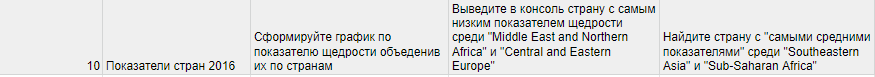
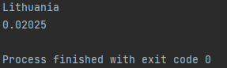
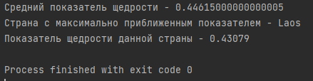

# Итоговой проект 

Задание для моего варианта приведено ниже
    

## Общая информация о данных

Для начала нужно распарсить данные с CSV файла, создать и подключить файл SQLITE
к проекту и создать на основе данных нужные таблицы.

Сам csv-файл выглядит таким образом:


Для каждой страны указан ее регион и ее показатели благополучия.

Как можно заметить, все показатели зависят только от страны, в то время как регион
зависит только от страны. Таким образом можно создать две таблицы в нашей базе данных:
"country" с ключом "countryName" и полем "regionName" и таблицу countryInfo со
всеми остальными полями, указанными в таблице.

Создадим класс Country, который будет представлять каждую запись нашей таблицы


*Полный код можно посмотреть в файле Country.java*
```
public class Country {
    private String CountryName;
    private String Region;
    private int HappinessRank;
    private double HappinessScore;
    private double LCI;
    private double UCI;
    private double Economy;
    private double Family;
    private double Health;
    private double Freedom;
    private double Trust;
    private double Generosity;
    private double DystopiaResidual;
    private String value;
    }
   ```

## Создание парсера
Далее создаем класс CsvParser и метод LoadCountries, который будет парсить данные из файла(полный код находится в файле CsvParser.java)
```
public static ArrayList<Country> countries = new ArrayList<>();

    public static void LoadCountries(String path){
        /*
        Метод читает каждую запись в csv файле, создает на ее основе обьект Country и добавляет его в ArrayList countries
         */
        try (BufferedReader br = Files.newBufferedReader(Paths.get(path))) {
            String line = br.readLine();
            while ((line = br.readLine())!=null){
                countries.add(new Country(line));
            }
        } catch (
                IOException e) {
            e.printStackTrace();
        }
    }
```

Все записи таблицы (обьекты Country) находятся в массиве countries

Так как таблицы для базы данных будут создаваться один раз, создадим их сразу в методе Main

```
String path = "Показатель счастья по странам 2016.csv";
        CsvParser.LoadCountries(path);
        try{
            Class.forName("org.sqlite.JDBC");
            Connection con = DriverManager.getConnection("jdbc:sqlite:countries.db");
            Statement statement = con.createStatement();
            String table_1 = "CREATE TABLE country (countryName VARCHAR(15) PRIMARY KEY, regionName VARCHAR(30))";
            String table_2 = "CREATE TABLE countryInfo(countryName VARCHAR(15) PRIMARY KEY, " +
                    "happinessRank INTEGER," +
                    "happinessScore DOUBLE," +
                    "LCI DOUBLE," +
                    "UCI DOUBLE," +
                    "Economy DOUBLE," +
                    "Family DOUBLE," +
                    "Health DOUBLE," +
                    "Freedom DOUBLE," +
                    "Trust DOUBLE," +
                    "Generosity DOUBLE," +
                    "Dystopia_Residual," +
                    "FOREIGN KEY (countryName) REFERENCES country(countryName))";
            statement.execute(table_1);
            statement.execute(table_2);
 ```

В классе CsvParser создаем два метода для вставки данных в таблицы 
```public static void InsertCountry(){
        try{
            /*
            Вставка данных в таблицу country
             */
            Class.forName("org.sqlite.JDBC");
            Connection con = DriverManager.getConnection("jdbc:sqlite:countries.db");
            Statement statement = con.createStatement();
            for(Country country : countries){
                statement.execute(String.format("INSERT INTO country VALUES('%s','%s')",country.getCountryName(),country.getRegion()));
            }
            System.out.println("Inserting complete");
        }
        catch (Exception e){
            e.printStackTrace();
        }
    }
   ```

```
 public static void InsertCountryInfo(){
        try{
            /*
            Вставка данных в таблицу countryInfo
             */
            Class.forName("org.sqlite.JDBC");
            Connection con = DriverManager.getConnection("jdbc:sqlite:countries.db");
            Statement statement = con.createStatement();
            String sql = "INSERT INTO countryInfo VALUES (?,?,?,?,?,?,?,?,?,?,?,?)";
            for(Country country : countries){
                PreparedStatement preparedStatement = con.prepareStatement(sql);
                preparedStatement.setString(1,country.getCountryName());
                preparedStatement.setInt(2,country.getHappinessRank());
                preparedStatement.setDouble(3,country.getHappinessScore());
                preparedStatement.setDouble(4,country.getLCI());
                preparedStatement.setDouble(5,country.getUCI());
                preparedStatement.setDouble(6,country.getEconomy());
                preparedStatement.setDouble(7,country.getFamily());
                preparedStatement.setDouble(8,country.getHealth());
                preparedStatement.setDouble(9,country.getFreedom());
                preparedStatement.setDouble(10,country.getTrust());
                preparedStatement.setDouble(11,country.getGenerosity());
                preparedStatement.setDouble(12,country.getDystopiaResidual());

                preparedStatement.executeUpdate();
            }
            System.out.println("Inserting complete");
        }
        catch (Exception e){
            e.printStackTrace();
        }
    }
 ```
## Выполнение заданий

В первом задании нужно сформировать график щедрости по странам.

Устанавливаем библиотеку JFreechart и в классе CsvParser создаем метод SeeDataSet, который строит и выводит гистограмму по 
нашим данным

```public static void SeeDataSet()
{
/*
Метод строит гистограмму данных по показателю щедрости
*/
try{ Class.forName("org.sqlite.JDBC");
Connection con = DriverManager.getConnection("jdbc:sqlite:countries.db");
Statement statement = con.createStatement();
var dataset = new DefaultCategoryDataset();
var rs = statement.executeQuery("SELECT countryName,Generosity FROM countryInfo");
while (rs.next()) {
dataset.addValue(rs.getDouble(2), rs.getString("countryName"), "");
}
JFreeChart chart = ChartFactory.createBarChart("График щедрости","Страны","Показатель щедрости",dataset);
ChartPanel panel = new ChartPanel(chart);
ChartFrame chartFrame = new ChartFrame("Test",chart);
chartFrame.setVisible(true);
}
catch (Exception e){
e.printStackTrace();
}
```
В итоге данный метод выводит гистограмму, приведенную ниже


Во втором задании необходимо вывести в консоль страну с самым низким показателем щедрости в регионах
'Middle East and Northern Africa' И 'Central and Eastern Europe'

Для этого в классе CsvParser реализуем метод GenerositySelect
```
public static void GenerositySelect(){
        /*
        Метод находит в базе данных страну с самым маленьким показателем щедрости в регионах
       'Middle East and Northern Africa' И 'Central and Eastern Europe'
         */
        try{
            Class.forName("org.sqlite.JDBC");
            Connection con = DriverManager.getConnection("jdbc:sqlite:countries.db");
            Statement statement = con.createStatement();
            var rs = statement.executeQuery("SELECT countryInfo.countryName,Generosity " +
                    "FROM countryInfo " +
                    "INNER JOIN country ON country.countryName = countryInfo.countryName " +
                    "WHERE Generosity = (SELECT MIN(Generosity) FROM countryInfo INNER JOIN country ON country.countryName = countryInfo.countryName " +
                    "WHERE regionName = 'Middle East and Northern Africa' OR regionName = 'Central and Eastern Europe');");
            System.out.println(rs.getString(1));
            System.out.println(rs.getDouble(2));
        } catch (Exception e){
            e.printStackTrace();
        }
    }
```

При выполнении данного метода в консоль выведется нужная страна с ее показатем щедрости




Третье задание подобно второму, но уже нужно найти страну, показатель щедрости которой
максимально приближен к среднему показателю щедрости. Для этого создадим метод **FindCountryWithAvgGenerosity**
в классе CsvParser

```
public static void FindCountryWithAvgGenerosity(){
        /*
        Метод находит страну с самым приближенным значением щедрости к среднему показателю щедрости среди стран
        в "Southeastern Asia" и "Sub-Saharan Africa".
         */

        try{
            Class.forName("org.sqlite.JDBC");
            Connection con = DriverManager.getConnection("jdbc:sqlite:countries.db");
            Statement statement = con.createStatement();
            var rs = statement.executeQuery("SELECT Generosity FROM countryInfo INNER JOIN country " +
                    "ON country.countryName = countryInfo.countryName WHERE regionName = 'Southeastern Asia' OR" +
                    " regionName = 'Sub-Saharan Aftica'");
            int count = 0;
            double sum = 0;
            while (rs.next())
            {
                count = count +1;
                sum = sum + rs.getDouble(1);
            }
            double avg = sum / count;
            double min = Double.MAX_VALUE;
            String countryName = "";
            double generosity = 0.0;
            var new_rs = statement.executeQuery("SELECT Generosity,country.countryName FROM countryInfo INNER JOIN country " +
                    "ON country.countryName = countryInfo.countryName WHERE regionName = 'Southeastern Asia' OR" +
                    " regionName = 'Sub-Saharan Aftica'");
            while(new_rs.next()){
                if (Math.abs(new_rs.getDouble(1)-avg)<min){
                    min = Math.abs(new_rs.getDouble(1)-avg);
                    countryName = new_rs.getString("countryName");
                    generosity = new_rs.getDouble(1);
                }
            }
            System.out.println("Средний показатель щедрости - "+avg);
            System.out.println("Страна с максимально приближенным показателем - "+countryName);
            System.out.println("Показатель щедрости данной страны - "+generosity);


        } catch (Exception e){
            e.printStackTrace();
        }
    }
```
В итоге данный метод выведет в консоль следующее:
